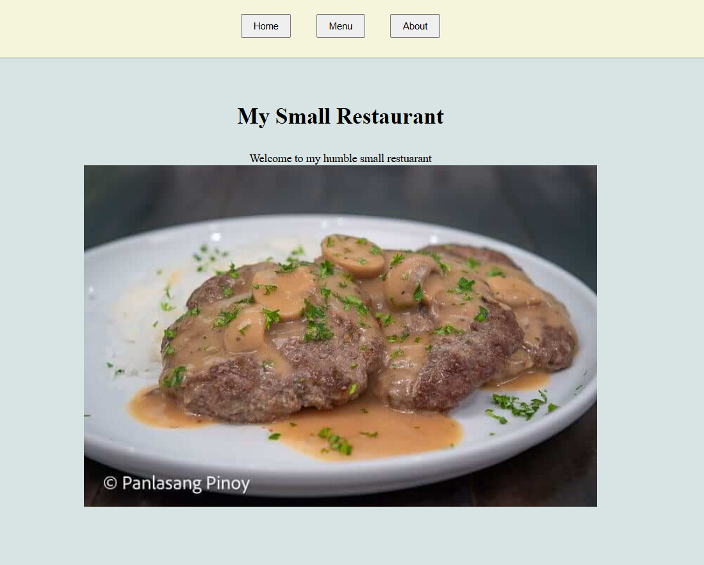

# TOP Restaurant using webpack

This is a simple practice of webpacking AKA bundling the code for optimization
---




## Get Started
```
npm install
npx webpack
npx webpack serve
```

## Learnings
1. Webpack is quite new 
2. There are implementations since it only reads JS and JSON

## Deployment of Webpack
The idea is to include the dist file and make it to other branch for deployment
```
git add dist -f && git commit -m "Deployment commit"
git subtree push --prefix dist origin gh-pages
git checkout main 
```